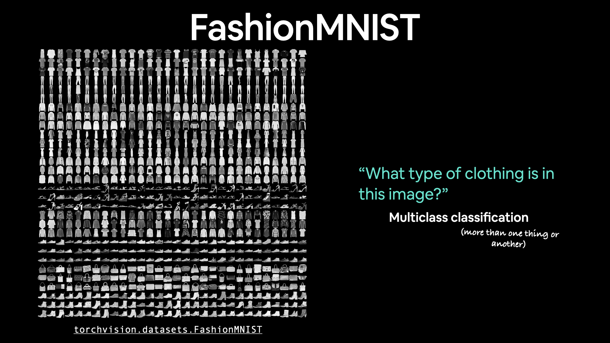
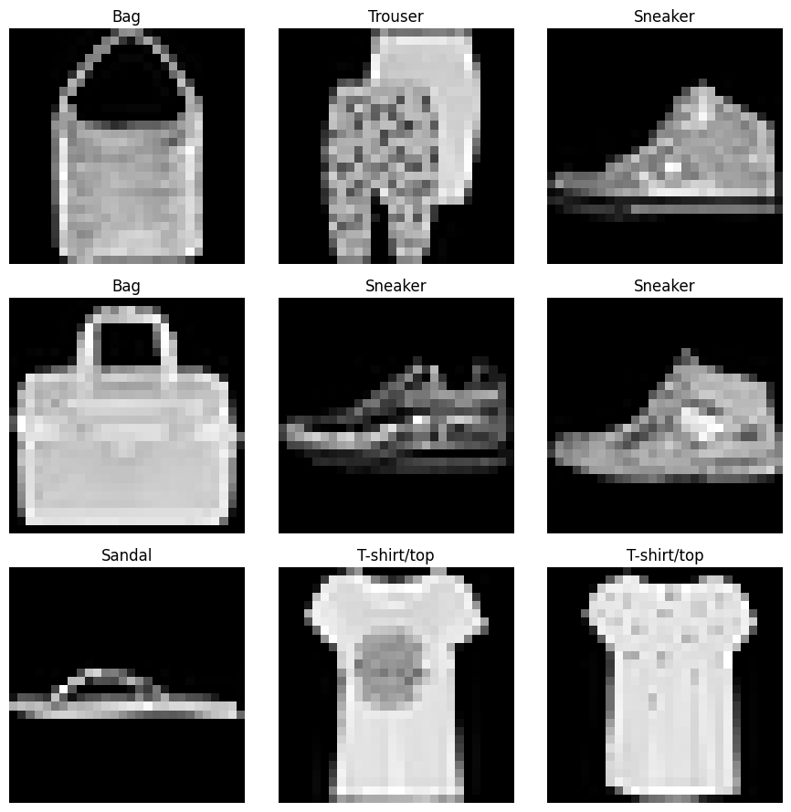
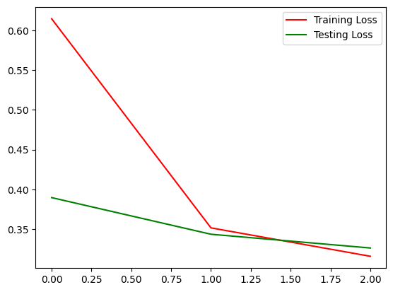
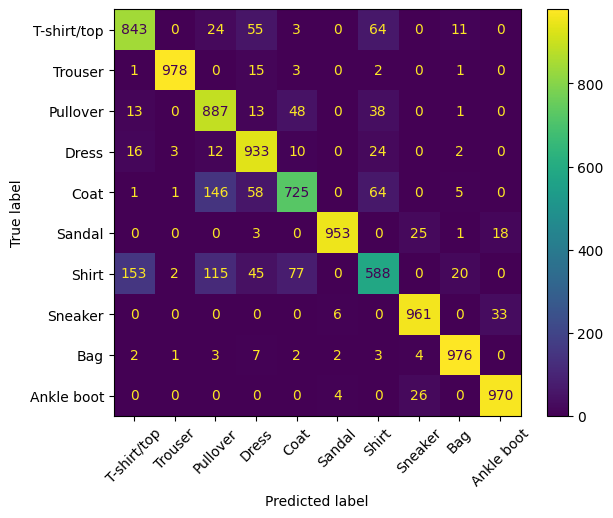

# Tiny VGG Fashion MNIST Custom Models

 <!-- Replace with the actual image path -->

## Overview
This notebook demonstrates the process of building and training a convolutional neural network (CNN) to classify images from the Fashion MNIST dataset. The Fashion MNIST dataset consists of 60,000 training images and 10,000 testing images of clothing items, each labeled with one of 10 categories.

## Input Samples
Below are some sample images from the Fashion MNIST dataset along with their corresponding labels:

## Model Journey
The journey begins with importing necessary libraries and loading the Fashion MNIST dataset. The dataset is preprocessed using transformations to convert images into tensors suitable for training.

### Steps Taken:
1. **Data Loading**: The Fashion MNIST dataset is loaded using `torchvision.datasets`. The training and testing datasets are prepared with appropriate transformations.
2. **Data Exploration**: Basic exploration of the dataset is performed to understand its structure and the shape of the images.
3. **Model Definition**: A custom CNN model is defined, which includes several convolutional layers followed by activation functions and pooling layers.
4. **Training**: The model is trained using the training dataset, and the training loss is monitored over epochs.
5. **Evaluation**: After training, the model is evaluated on the test dataset, and predictions are made.
6. **Confusion Matrix**: A confusion matrix is generated to visualize the performance of the model across different classes.

### Model Description
The CNN model defined in this notebook consists of:
- **Convolutional Layers**: These layers apply filters to the input images to extract features.
- **Activation Functions**: ReLU (Rectified Linear Unit) is used to introduce non-linearity into the model.
- **Pooling Layers**: Max pooling is used to reduce the spatial dimensions of the feature maps, which helps in reducing computation and controlling overfitting.
- **Fully Connected Layers**: These layers are used at the end of the network to make predictions based on the features extracted by the convolutional layers.

## Results
The results of the training and evaluation process are visualized through plots of training and testing loss over epochs, as well as a confusion matrix that illustrates the model's classification performance.

### Loss Curves
Below are the loss curves for the training and testing phases over three epochs:

 <!-- Replace with the actual image path -->

### Images
All relevant images generated during the training and evaluation process are saved in the `images` folder. This includes:
- Training and testing loss plots
- Confusion matrix visualizations

 <!-- Replace with the actual image path -->

## Conclusion
This notebook provides a comprehensive guide to building a CNN for image classification using the Fashion MNIST dataset. The model's performance can be further improved by experimenting with different architectures, hyperparameters, and data augmentation techniques.

## Requirements
- Python 3.x
- PyTorch
- torchvision
- matplotlib
- scikit-learn

## Usage
To run this notebook, ensure you have the required libraries installed and execute the cells in order. The model can be trained and evaluated on your local machine or in a cloud environment with GPU support for faster training.
